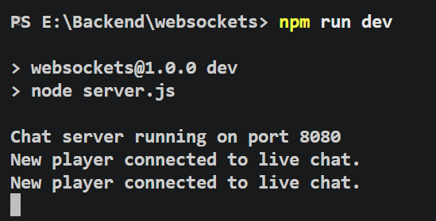
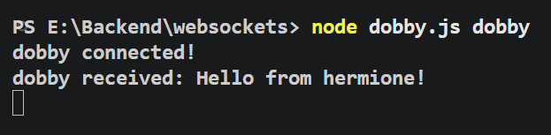
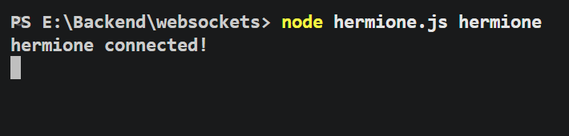

<p align="center">
  
</p>

<h1 align="center">WebSocket Real-Time Chat Server</h1>

<h3 align="center">
Real-Time Communication using Node.js, Express.js and WebSockets
</h3>

<p align="center">
  
  
  
  
  
</p>

---

## Screenshots

<h3 align="center">Server</h3>

<p align="center">
  
</p>

<h3 align="center">Clients</h3>

<p align="center">
  
  
</p>

**"Express provides the application layer, while Node's HTTP module creates the underlying HTTP server. I use the HTTP server because I need to attach the WebSocket server to it."**

**Convert message to string**

**const payload = message.toString();**

**The WebSocket library gives us the incoming message as data that may be represented as a Buffer.**

**We convert it into a string.**

**For production-scale systems, you'd typically introduce a shared messaging layer**

```text
**Client
   ↓
Load Balancer
   ↓
┌──────────┐
│ Server 1 │
└──────────┘
      ↕
 Redis Pub/Sub
      ↕
┌──────────┐
│ Server 2 │
└──────────┘**


